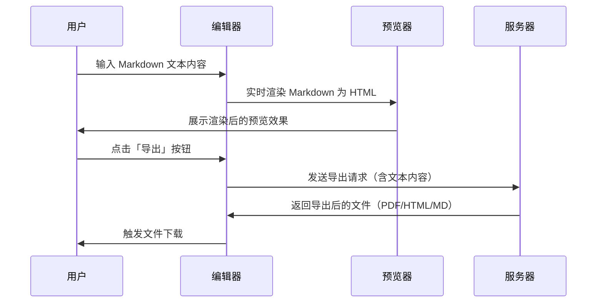

#IPTV 智能整理平台 · 自治版
全自动 IPTV 直播源采集、测速、验证、分类、合并与自治管理平台。
通过 GitHub Actions 定时运行，无需服务器，永久免费。
# 
## 📖 目录
### 
- ***功能特点***
- ***系统架构***
- ***快速开始***
     - Fork 仓库
     - 查看输出
     - 自定义配置
- ***运行方式***
- ***配置说明***
- ***输出文件***
- ***自治模式详解***
- ***固定源管理***
- ***免责声明***

# ✨ 功能亮点
- 多源聚合 – 同时拉取 10+ 公开 IPTV 源，自动解析 M3U / TXT 格式，智能去重。
- 双重测速 – HTTP 快速探测 + ffmpeg 深度验证（可选），过滤无效、广告、黑名单 URL。
- 智能分类 – 按央视、卫视、地方（省份）、港澳台自动归类，支持拼音模糊匹配。
- 固定源保护 – 用户可预设优质源，系统永不自动替换，同时支持动态优化（自动选择延迟最低的备源）。
- 自治模式 – 源池 → 候选观察 → 稳定提升 → 质量监控 → 自动回滚，实现“发现-验证-提升”闭环。
- 候选池管理 – 新源先进入候选池，经过多次验证（成功率、延迟）达标后才提升为稳定源。
- 质量预测 – 基于历史测速数据预测失效概率，提前替换高风险源。
- 多格式输出 – 生成 tv.m3u、tv.txt、tv_multi.m3u、channels.json，并自动追加智能补充分类（网络电台、音乐等）。
- 完全自动化 – 通过 GitHub Actions 每 6 小时自动运行，输出文件直接托管在仓库中，可随时通过 raw 链接访问。
## 🚀 快速开始
### 方式一：使用 GitHub Actions（推荐）
1. Fork 本仓库 到你的 GitHub 账号。
2. 启用 Actions：进入仓库 → Actions 标签 → 点击
  I understand my workflows, go ahead and enable them。
3. 手动触发首次运行（可选）：
- 进入 Actions → IPTV 源智能更新与整理 → Run workflow → 点击 Run workflow。
4. 获取播放列表：
- 标准 M3U：https://你的用户名.github.io/ITV/output/tv.m3u
- 标准 TXT：https://你的用户名.github.io/ITV/output/tv.txt
- JSON API：https://你的用户名.github.io/ITV/output/channels.json
    替换 你的用户名 为你的 GitHub 账号名。
### 方式二：本地运行（调试用）

```python
git clone https://github.com/你的用户名/ITV.git
cd ITV
pip install -r requirements.txt
# 可选：安装 ffmpeg（用于深度验证）
sudo apt-get install ffmpeg   # Ubuntu/Debian
# 运行
python -m src.run
```

## ⚙️ 配置说明
 所有配置通过环境变量（.env 文件）管理，GitHub Actions 中已预设默认值，你也可以在仓库的 Settings → Secrets and variables → Actions 中添加自定义变量覆盖。

## 核心配置项
| 变量       |    默认值        | 状态      |
|------------|----------------------|-----------|
|AUTONOMOUS_MODE   | true | 是否启用自治模式（建议开启） |
| MAX_WORKERS | 20 | 并发测速线程数 |
| TIMEOUT  | 8     | HTTP 超时（秒） |
| FFMPEG_ENABLE  | true     | 是否启用 ffmpeg 深度验证 |
| FFMPEG_MODE  | deep   | 	deep / quick / off|
| CANDIDATE_MIN_SUCCESS    |    3     |     候选源最少成功次数               |
|   CANDIDATE_MIN_SUCCESS_RATE      |   0.5     |       候选源最低成功率（50%）               |
|  CANDIDATE_MAX_LATENCY          |    3000          |      候选源最大平均延迟（毫秒）           |
|  SLOW_SPEED_THRESHOLD          |       3000       |      慢速阈值（超过此值不进入稳定版）            |
|  ENABLE_DEMO_FILTER          |    true          |       是否按 demo.txt 筛选频道           |
|    ENABLE_BLACKLIST        |       true       |     是否启用黑名单过滤             |
|    MAX_SOURCES_PER_CHANNEL          |      3     |    每个频道保留的最大源数量          | 

    完整配置项见 .env.example。
## 📂 输出文件说明
|      文件        |     说明        |
|------------|----------------------|
|       output/tv.m3u       |       标准 M3U 播放列表（按 demo.txt 顺序，仅包含有效源）       |
|      output/tv.txt        |     TXT 格式（频道名,URL），兼容大部分播放器         |
|      output/tv_multi.m3u     |    多源 M3U，每个频道包含多个备选地址（用 # 分隔），播放器可自动切换     |
|     output/channels.json         |    JSON API，包含频道名、URL、延迟、编码等信息          |
|   output/stats.json           |  运行统计（频道总数、分类统计、时间戳等）            |
|    output/stable_sources.json          |  稳定源列表（含固定标记和延迟）            |
|  data/candidate_pool.json            |   候选池（观察中的源）           |
|    data/source_pool.json          |   源池（所有发现过的源）           |


### 🧠 自治模式工作流程


## 时序图

1. 采集阶段：拉取所有配置的 IPTV 源，解析并去重。

2. 测速验证：HTTP 探测 + ffmpeg 深度验证，过滤无效源，结果写入候选池。

3.  观察期：候选源经过多次验证（次数≥3、成功率≥50%、延迟≤3000ms）后标记为稳定。

4. 提升阶段：稳定候选源替换同名劣质源，并记录到 stable_sources.json。

5. 质量监控：稳定源持续检测，连续失败 3 次触发告警，预测失效概率超过阈值则自动从候选池寻找替代。


## 🔒 固定源配置
你可以在 src/fixed_sources.py 中预设优质源，系统将优先使用这些源，并永不自动替换（除非配置 auto_optimize=True 允许动态优化）。

示例：
```python
CCTV_FIXED_SOURCES = {
    "CCTV-1": ["http://example.com/cctv1.m3u8", "http://backup.com/cctv1.m3u8"],
    "CCTV-5+": ["http://example.com/cctv5plus.m3u8"],
}
```
固定源同样支持多地址，系统会自动选择延迟最低的有效地址。

## 🧩 智能补充分类
除了常规频道，项目还会从 https://tv.19860519.xyz/abc123 源中采集以下分类并追加到输出文件：
- 📻 网络电台
-🎤 韩国女团
- 🔥 热门歌曲
- 🎧 动感舞曲
- 💃 广场舞
这些频道经过测速验证，仅保留可用源，丰富你的播放列表。

📺央视频道,#genre#
CCTV-1
CCTV-2
...
📡卫视频道,#genre#
北京卫视
东方卫视
...
支持拼音模糊匹配和省份自动归类，未在 demo.txt 中列出的频道会按省份自动追加到对应分类。

## ⚠️ 免责声明
- 本项目仅用于个人学习和测试，不用于任何商业用途。
- 所有节目源均来自互联网公开链接，项目本身不存储、不篡改任何媒体内容。
- 严禁将本项目及生成的播放列表用于商业传播、二次分发。
- 所有频道版权归原版权方所有，使用前请确保符合当地法律法规。
- 因违规使用产生的任何法律责任，均由使用者自行承担。
